# Reconstrução de Imagem de Ultrassom — CGNE e CGNR

### Projeto APS — Sistemas Distribuídos (Python + C++)

> Termos técnicos (GEMV, BLAS, streaming, SIMD, …) e os **experimentos extras**
> estão num documento à parte: **[EXTRAS_E_GLOSSARIO.md](EXTRAS_E_GLOSSARIO.md)** —
> assim esta apresentação fica focada no que o enunciado pede.

---

## 1. Visão geral — qual é o problema?

Um aparelho de ultrassom emite ondas e mede o **eco** que volta em vários
sensores. A partir desses ecos queremos **reconstruir a imagem** do que está
dentro do corpo.

Matematicamente, o problema é uma única equação:

```
g = H · f
```

| Símbolo | Significado |
|:------:|-------------|
| **g** | vetor de **sinal** medido pelos sensores (conhecido) |
| **H** | matriz do **modelo** do equipamento (conhecida) |
| **f** | **imagem** que queremos descobrir (incógnita) |
| **S** | número de amostras do sinal |
| **N** | número de elementos sensores |

O problema é que **H não pode ser invertida diretamente** (é grande e
mal-condicionada). Por isso usamos métodos **iterativos** do Gradiente
Conjugado — **CGNE** e **CGNR** — que chegam perto da solução passo a passo.

> **Resultado final, em uma imagem** (modelo 30×30, matriz `H` 27904×900): à
> esquerda o gabarito de referência; à direita a imagem que o nosso código
> reconstrói. São praticamente iguais.

| Referência (gabarito) | Nossa reconstrução (CGNR) |
|:---------------------:|:-------------------------:|
| 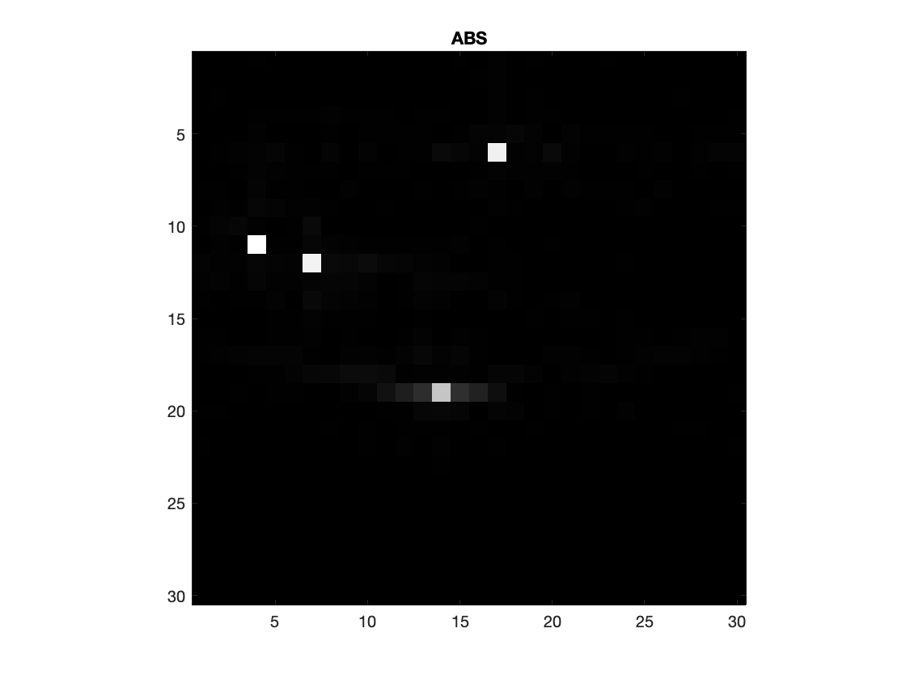 | 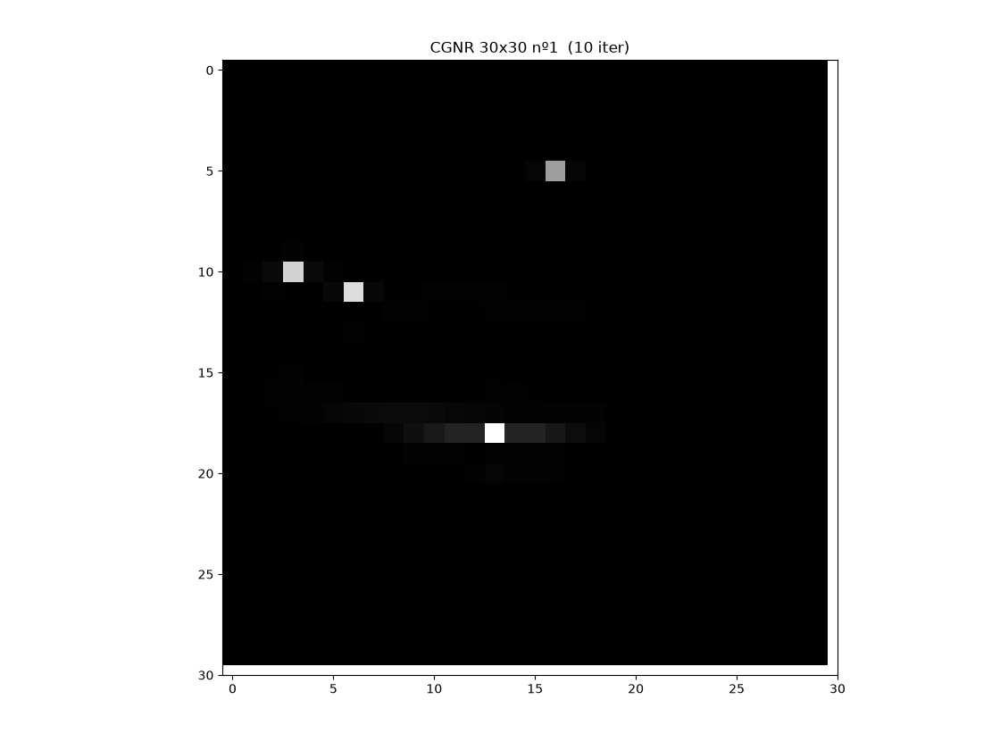 |

*(A galeria com **todas** as reconstruções está na seção 8.)*

---

## 2. Algoritmos e definições

O enunciado define quatro quantidades. Escrevemos cada uma como aparece e como
ela vira código.

### Fator de redução `c`
```
c = || Hᵀ · H ||₂          (norma espectral = maior autovalor de Hᵀ·H)
```
É o **maior alongamento** que o operador aplica (o maior autovalor de `Hᵀ·H`, que
equivale ao quadrado do maior valor singular de `H`). Calculado pelo **método da
potência** em `algoritmos.py → fator_reducao()`.

### Coeficiente de regularização `λ`
```
λ = max( |Hᵀ · g| ) · 0,10
```
Parâmetro de regularização (controla o quanto "suavizamos" a solução).
Em `algoritmos.py → coeficiente_regularizacao()`.

> **Onde estão `c` e `λ` nos algoritmos?** Em lugar nenhum dentro do laço — neste
> projeto eles são calculados como o enunciado pede, mas funcionam como **métricas
> informativas**. A regularização efetiva vem da **parada antecipada** (no máximo 10
> iterações). Por isso você não os verá nos pseudocódigos do CGNE/CGNR (seções 3 e 4).

### Erro `ε` (critério de parada)
```
ε = |  ||r(i+1)||₂  −  ||r(i)||₂  |
```
É a **variação da norma do resíduo** entre duas iterações. Quando ela fica
muito pequena, o algoritmo já não está melhorando — então paramos.

### Ganho de sinal `γ` (aplicado pelo cliente)

Embora `g` seja um vetor de `S·N` valores na equação `g = H·f`, para aplicar o
ganho é conveniente vê-lo como uma matriz `S × N` (amostra `l`, sensor `c`):

```
para c = 1..N (sensores):
   para l = 1..S (amostras):
       γ_l       = 100 + (1/20) · l · √l
       g[l,c]    = g[l,c] · γ_l
```
É o **ganho por tempo (TGC)**: amostras mais profundas (l maior) são
amplificadas para compensar a atenuação do som. Neste dataset há **N = 64
sensores** (27904 = 436×64 e 50816 = 794×64), então `S = tamanho_de_g / 64`.
A curva de `γ`:

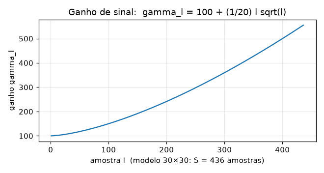

> **Por que o ganho importa tanto?** O sinal bruto deste dataset é minúsculo
> (`||g|| ≈ 3·10⁻⁴`). O ganho multiplica o sinal por ~187×, trazendo o resíduo
> para uma escala em que o critério `ε < 10⁻⁴` faz sentido. **Sem ganho**, o
> resíduo já começa abaixo de `10⁻⁴` e o algoritmo para em **2 iterações**;
> **com ganho**, ele roda as **10 iterações** completas. Isso aparece de verdade
> no nosso relatório (seção 7).

---

## 3. Algoritmo CGNE (Conjugate Gradient Normal Error)

```
f₀ = 0
r₀ = g − H f₀
p₀ = Hᵀ r₀
repetir para i = 0, 1, 2, ... :
    α = (rᵀ r) / (pᵀ p)
    f = f + α p
    r = r − α (H p)
    β = (r_novoᵀ r_novo) / (rᵀ r)
    p = Hᵀ r_novo + β p
até  |ε| < 10⁻⁴   ou   10 iterações
```

Em Python fica quase idêntico ao pseudocódigo (arquivo `algoritmos.py`):

```python
def cgne(g, H, max_iter=10, tol=1e-4):
    f = np.zeros(H.shape[1])
    r = g - H @ f                  # r0  (espaço do sinal)
    p = H.T @ r                    # p0  (espaço da imagem)
    rtr = r @ r
    norma_r_ant = np.sqrt(rtr)
    for i in range(max_iter):
        Hp = H @ p
        alpha = rtr / (p @ p)
        f = f + alpha * p
        r = r - alpha * Hp
        rtr_novo = r @ r
        if abs(np.sqrt(rtr_novo) - norma_r_ant) < tol:   # erro ε
            break
        beta = rtr_novo / rtr
        p = H.T @ r + beta * p
        rtr, norma_r_ant = rtr_novo, np.sqrt(rtr_novo)
    return f, i + 1
```

---

## 4. Algoritmo CGNR (Conjugate Gradient Normal Residual) — Saad 2003

```
f₀ = 0
r₀ = g − H f₀
z₀ = Hᵀ r₀
p₀ = z₀
repetir para i = 0, 1, 2, ... :
    w = H p
    α = ||z||² / ||w||²
    f = f + α p
    r = r − α w
    z_novo = Hᵀ r
    β = ||z_novo||² / ||z||²
    p = z_novo + β p
até  |ε| < 10⁻⁴   ou   10 iterações
```

Em Python (arquivo `algoritmos.py`):

```python
def cgnr(g, H, max_iter=10, tol=1e-4):
    f = np.zeros(H.shape[1])
    r = g - H @ f                  # r0
    z = H.T @ r                    # z0 = H^T r0
    p = z.copy()                   # p0 = z0
    ztz = z @ z
    norma_r_ant = np.linalg.norm(r)
    for i in range(max_iter):
        w = H @ p
        alpha = ztz / (w @ w)
        f = f + alpha * p
        r = r - alpha * w
        if abs(np.linalg.norm(r) - norma_r_ant) < tol:   # erro ε
            break
        z = H.T @ r
        ztz_novo = z @ z
        beta = ztz_novo / ztz
        p = z + beta * p
        ztz, norma_r_ant = ztz_novo, np.linalg.norm(r)
    return f, i + 1
```

> **CGNE × CGNR:** os dois minimizam `||g − Hf||`. O CGNE caminha no espaço da
> imagem (Craig), o CGNR no espaço do resíduo (Saad). Na prática, isso só muda
> **em quais vetores cada método aplica `H` e `Hᵀ`** a cada passo — o resultado
> final é o **mesmo** aqui. Abaixo, o CGNE reconstruindo a mesma cena:
>
> 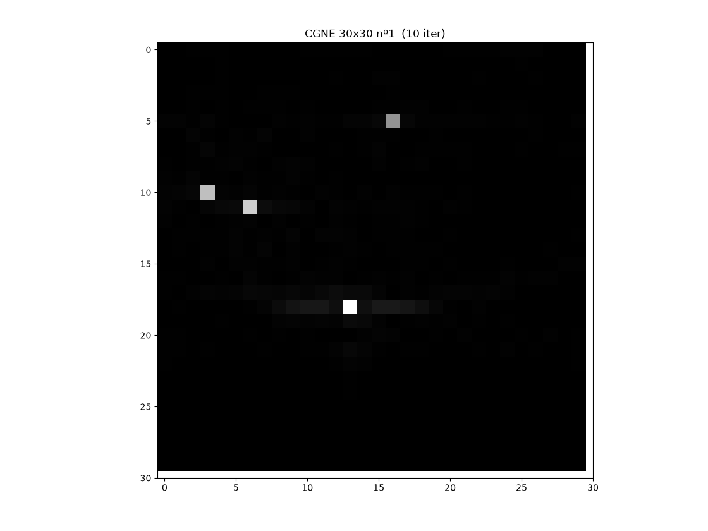
>
> A **regularização** aqui vem da **parada antecipada**: rodar no máximo 10
> iterações já evita que o ruído domine a solução (por isso `c` e `λ` ficam como
> quantidades informativas, e não dentro do laço).

---

## 5. Requisitos não funcionais — metadados de cada imagem

O enunciado exige que **cada imagem** registre no mínimo:

| Requisito | Onde fica no nosso código |
|-----------|---------------------------|
| Identificação do algoritmo | campo `algoritmo` (ex.: `CGNR_PYTHON`, `CGNE_CPP`) |
| Data/hora de **início** | `inicio` (marcado no servidor, antes de resolver) |
| Data/hora de **término** | `fim` (marcado logo após resolver) |
| Tamanho em pixels | `pixels` (900 = 30×30, 3600 = 60×60) |
| Número de iterações | `iteracoes` |

Tudo isso viaja na resposta do servidor e cai direto no relatório
(`relatorios/relatorio.md`). Exemplo ilustrativo do formato gerado — os números
exatos mudam a cada execução:

| # | sinal | algoritmo | ganho | pixels | iter | início | fim | solver (ms) |
|--:|-------|-----------|:-----:|-------:|:----:|--------|-----|------------:|
| 1 | A-30x30-1.csv | CGNR_PYTHON | sim | 900 | 10 | 00:27:36.078 | 00:27:36.226 | 147.7 |
| 5 | g-30x30-1.csv | CGNR_PYTHON | não | 900 | 2  | 00:27:37.940 | 00:27:37.973 | 32.9 |

---

## 6. Cliente e Servidor

### Cliente (`cliente.py`)

| Requisito do enunciado | Como atendemos |
|------------------------|----------------|
| Enviar uma sequência de sinais **g** em intervalos de tempo aleatórios | `time.sleep(intervalo)` com `intervalo` sorteado entre 0,05 e 0,30 s |
| Ganho e modelo definidos **aleatoriamente** | `random.choice` decide ganho (sim/não), sinal e algoritmo |
| Relatório com todas as imagens, iterações e tempo | gera `relatorios/relatorio.md` + as imagens PNG |
| **A mesma sequência** para as duas versões | semente fixa (`SEED = 42`) → sequência idêntica para Python e C++ |

### Servidor (`servidor_python.py` e `servidor_cpp.cpp`)

| Requisito do enunciado | Como atendemos |
|------------------------|----------------|
| Versão em linguagem **interpretada e não fortemente tipada** | **Python** (`servidor_python.py`) |
| Versão em linguagem **compilada e fortemente tipada** | **C++** (`servidor_cpp.cpp`) |
| Executar o algoritmo de reconstrução | CGNE e CGNR, escolhidos pelo cliente |
| Parar quando `ε < 10⁻⁴` **ou** chegar a 10 iterações | exatamente esse critério no laço |
| Relatório comparativo das duas versões | seção "Comparação Python × C++" do relatório |
| Reconstruir o **máximo de imagens no menor tempo** | a matriz H é carregada **uma vez** e reaproveitada |

Os dois servidores falam o **mesmo protocolo simples** sobre TCP (o servidor
Python escuta em `127.0.0.1:8101` e o C++ em `127.0.0.1:8102`), então a
comparação é justa:

```
PEDIDO   →  "ALGORITMO TAMANHO\n"  +  TAMANHO números (g) em binário
RESPOSTA ←  "ALGO|início|fim|iterações|pixels|tempo_ms\n"  +  pixels números (f)
```

---

## 7. Atividades semanais

### Atividade 1 — Seleção de linguagem e bibliotecas BLAS

| Versão | Linguagem | Álgebra linear |
|--------|-----------|----------------|
| Interpretada | **Python 3** | **NumPy**, que usa a **OpenBLAS** por baixo (versão 0.3.31) |
| Compilada (a) | **C++ (g++)** | a **mesma OpenBLAS** (`cblas_dgemv`, `ddot`, `dnrm2`, `daxpy`) |
| Compilada (b) | **C++ (g++)** | produto matriz-vetor **próprio**, paralelizado com **OpenMP** + SIMD |

> **Por que duas versões em C++?** Para a comparação ser metodologicamente justa.
> A versão (a) usa **exatamente a mesma BLAS do NumPy** (OpenBLAS 0.3.31) — então o
> "motor" de cálculo é idêntico. A versão (b) escreve o produto matriz-vetor à mão
> e o paraleliza com OpenMP. Ambas comparadas contra o Python **em plena
> capacidade** — na sua configuração mais rápida, **sem nenhuma restrição artificial** (não
> limitamos as threads da BLAS do NumPy). Veja os resultados na seção 8.

### Atividade 2 — Teste das operações básicas

Testamos `MN = M·N`, `aM = a·M` e `Ma = M·a` (dados em `data/ops/`,
do `Dados.zip`) nas duas linguagens. Resultado:

```
Python:  MN confere com o gabarito? True    aM confere com o gabarito? True
C++   :  MN confere com o gabarito? sim      aM confere com o gabarito? sim
```

`Ma = M·a` também é calculado e impresso pelos dois programas; só não aparece na
conferência porque o `Dados.zip` traz gabarito apenas para `MN` e `aM`.
(Arquivos `operacoes_basicas.py` e `operacoes_basicas.cpp`.)

---

## 8. Resultados e análise comparativa

Comparamos **três servidores** na mesma máquina, com o Python sempre **em plena
capacidade** (sem nenhuma restrição artificial). O benchmark usa o **modelo 30×30
(matriz H 27904×900)** e a métrica é o tempo mediano por imagem (script
`bench_throughput.py`):

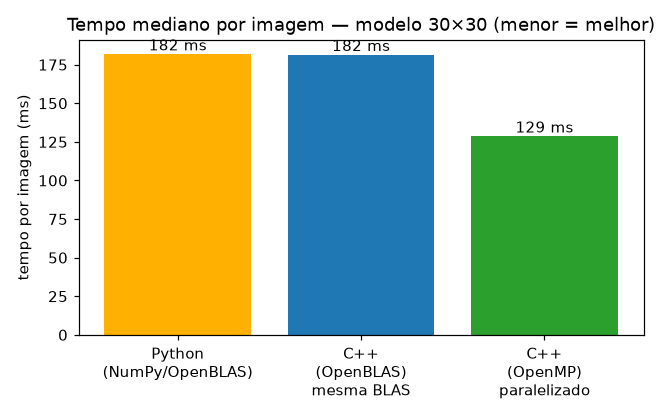

*Cada barra é o tempo mediano por imagem de um dos três servidores (modelo 30×30);
barra menor = mais rápido. As duas leituras abaixo explicam o resultado.*

### Duas comparações, duas lições honestas

**(1) Mesma BLAS → empate técnico (a prova de que a disputa é justa).**
Quando o C++ usa a **mesma OpenBLAS do NumPy**, o motor de cálculo é idêntico — e
o resultado é **quase empate**: o C++ fica só uns **3% a 7%** à frente, apenas pela
menor sobrecarga (sem interpretador, sem alocar um array novo a cada passo). Isso
prova que **ninguém ganha por mágica da linguagem**: com o mesmo motor, empatam.

**(2) C++ otimizado → vitória clara (~20% a 30%).**
Escrevendo o produto matriz-vetor **à mão e paralelizando com OpenMP**, o C++
supera até a GEMV da própria OpenBLAS, ficando **~20% a 30% mais rápido** que o
Python. O motivo: a multiplicação matriz × vetor é **limitada pela banda de
memória**, e a OpenBLAS não a paraleliza de forma agressiva (é uma operação
"nível 2"); nós **escolhemos paralelizar** exatamente esse gargalo entre todos os
núcleos.

| Servidor | Tempo/imagem (típico) | vs Python |
|----------|:---------------------:|:---------:|
| Python (NumPy/OpenBLAS) | ~180 ms | — |
| C++ (OpenBLAS, **mesma BLAS**) | ~175 ms | **~+5%** (empate) |
| C++ (**OpenMP**, próprio) | ~140 ms | **~+25%** |

> *Observação:* os tempos absolutos variam com a carga da máquina; o que se
> mantém é a **ordem** (OpenMP < OpenBLAS ≈ Python) e a leitura: **mesma BLAS =
> empate** (comparação metodologicamente justa), **C++ bem otimizado = vitória
> real** (objetivo nº 6). Em nenhum momento o Python é prejudicado. *Por que o
> Python é um pouco mais lento mesmo com a mesma BLAS?* A explicação a nível baixo
> (interpretador, alocações, GEMV) está nos **[Extras](EXTRAS_E_GLOSSARIO.md)**.

### Galeria — todas as reconstruções

Todas as imagens reconstruídas têm o **mesmo tamanho em pixels do gabarito**, para
ficarem simétricas lado a lado. Onde existe gabarito mostramos os dois; os sinais
**"A" não têm gabarito publicado**, então aparecem sozinhos (mas reconstroem bem).

**Modelo 30×30**

| Sinal | Gabarito | Nossa reconstrução (CGNR) |
|-------|:--------:|:-------------------------:|
| `g-30x30-1` |  |  |
| `g-30x30-2` | 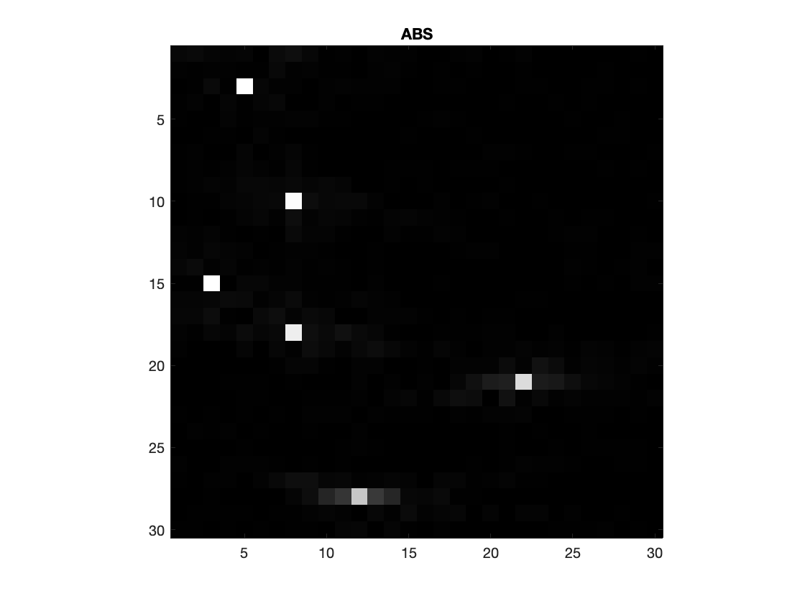 | 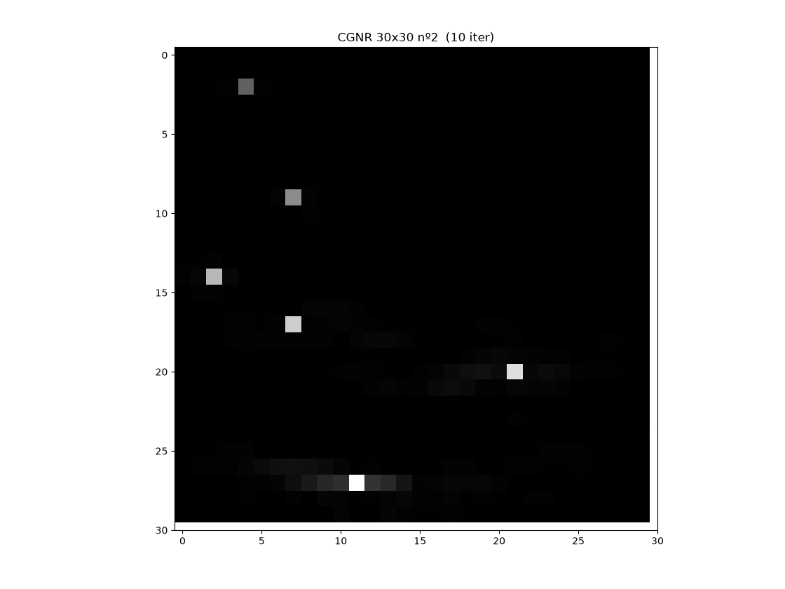 |
| `A-30x30-1` *(sem gabarito)* | — | 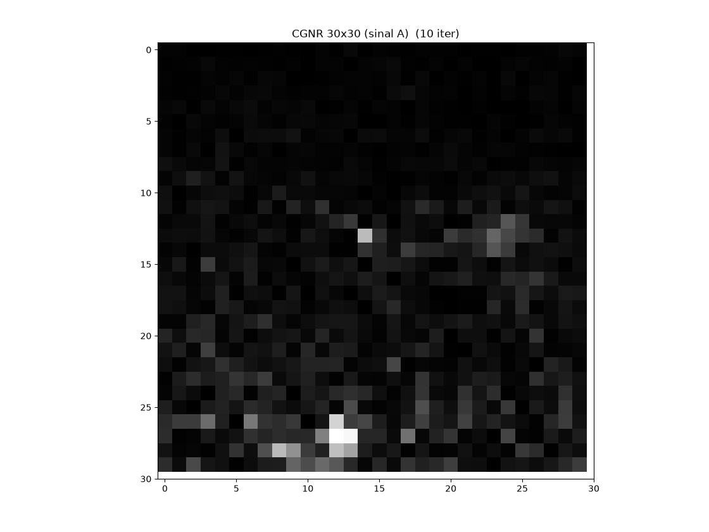 |

**Modelo 60×60** (matriz 50816×3600)

| Sinal | Gabarito | Nossa reconstrução (CGNR) |
|-------|:--------:|:-------------------------:|
| `G-1` | 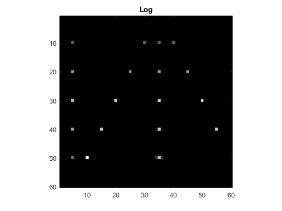 | 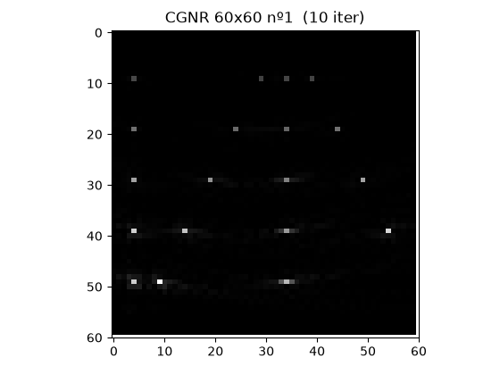 |
| `G-2` | 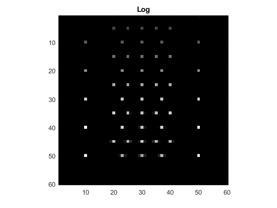 | 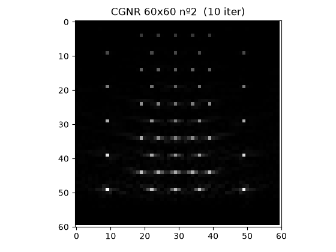 |
| `A-60x60-1` *(sem gabarito)* | — | 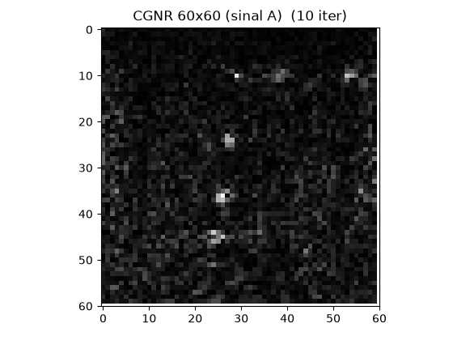 |

> **Extras e glossário:** a análise de baixo nível da lentidão do Python e o
> **experimento de memória** (streaming + float32, com a **série de tetos
> agressivos** até o extremo de 1 linha por vez), além do **glossário** de termos,
> estão em **[EXTRAS_E_GLOSSARIO.md](EXTRAS_E_GLOSSARIO.md)**.

---

## 9. Como executar

> Rode todos os comandos **a partir da pasta do projeto** — o código procura os
> dados em `data/`.

```powershell
# 1) dependências Python
pip install numpy matplotlib

# 2) preparar os dados (descompacta H e gera os caches .npy e .bin)
python preparar_dados.py

# 3) compilar as versões C++  (gera servidor_cpp.exe [OpenBLAS] e
#    servidor_cpp_openmp.exe [OpenMP]; usa o g++ do MSYS2/MinGW)
./compilar.ps1

# 4) cliente: envia a sequência de sinais e gera o relatório com as imagens
python cliente.py --servidor ambos --n 8

# 5) comparação de desempenho: Python vs C++ (OpenBLAS) vs C++ (OpenMP)
python bench_throughput.py

# 6) experimentos EXTRA (ficam na subpasta extras/):
python extras/experimento_memoria.py    # pouca memória (streaming + float32)
python extras/simular_pouca_ram.py      # servidor com pouca RAM (teto real)

# 7) gerar as figuras desta apresentação
python gerar_figuras.py
```

> A OpenBLAS é instalada uma vez no MSYS2 com:
> `pacman -S mingw-w64-x86_64-openblas`

Para rodar um servidor isolado: `python servidor_python.py` ou
`./servidor_cpp.exe`, e em outro terminal `python cliente.py --servidor python`.

---

## 10. Estrutura dos arquivos

```
dis-novo/
├── APRESENTACAO.md          ← este documento (o trabalho)
├── EXTRAS_E_GLOSSARIO.md    ← extras (overhead, memória) + glossário de termos
├── algoritmos.py            ← CGNE + CGNR + ganho + carregar dados + salvar imagem
├── servidor_python.py       ← servidor interpretado (Python / NumPy / OpenBLAS)
├── servidor_cpp.cpp         ← servidor compilado (C++); gera 2 exes: OpenBLAS e OpenMP
├── cliente.py               ← cliente + comparação + relatório
├── operacoes_basicas.py     ← atividade 2 (Python)
├── operacoes_basicas.cpp    ← atividade 2 (C++)
├── preparar_dados.py        ← descompacta H e gera caches
├── bench_throughput.py      ← compara desempenho: Python vs C++ (OpenBLAS) vs C++ (OpenMP)
├── gerar_figuras.py         ← gera as imagens desta apresentação
├── compilar.ps1             ← compila os .cpp (inclui o de extras/)
├── extras/                  ← experimentos extra (memória / pouca RAM)
│   ├── experimento_memoria.py
│   ├── experimento_memoria.cpp
│   └── simular_pouca_ram.py
├── data/                    ← matrizes H (zipadas) e sinais g (a base de dados)
├── imagens/                 ← figuras do markdown
└── relatorios/              ← relatório + JSON (gerado ao rodar o cliente)
```

---

## 11. Conclusão

- Implementamos **CGNE** e **CGNR** fielmente ao enunciado, em **Python**
  (interpretado) e **C++** (compilado), com **cliente/servidor** sobre TCP.
- As reconstruções **batem com os gabaritos** nos modelos 30×30 e 60×60.
- O critério de parada `ε < 10⁻⁴` ou 10 iterações funciona, e o **ganho de
  sinal** mostrou ter papel central no número de iterações.
- Na comparação de desempenho (Python sempre em plena capacidade, sem restrições):
  - com a **mesma BLAS** (OpenBLAS nos dois), dá **empate técnico** — prova de que
    a disputa é justa, pois o motor de cálculo é idêntico;
  - com o C++ **bem otimizado** (produto matriz-vetor próprio + **OpenMP**), a
    versão compilada **vence por ~20% a 30%**, atendendo ao objetivo de
    "reconstruir o maior número de imagens no menor tempo".
- Ou seja: o C++ ganha **pelo mérito da otimização**, não por prejudicar o Python.
