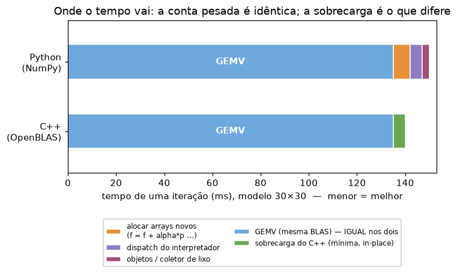
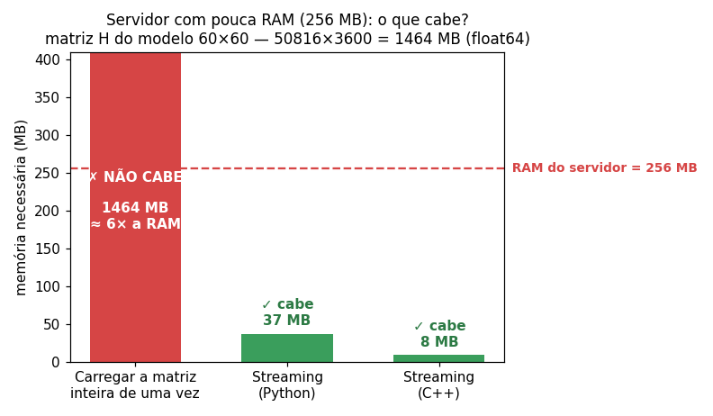
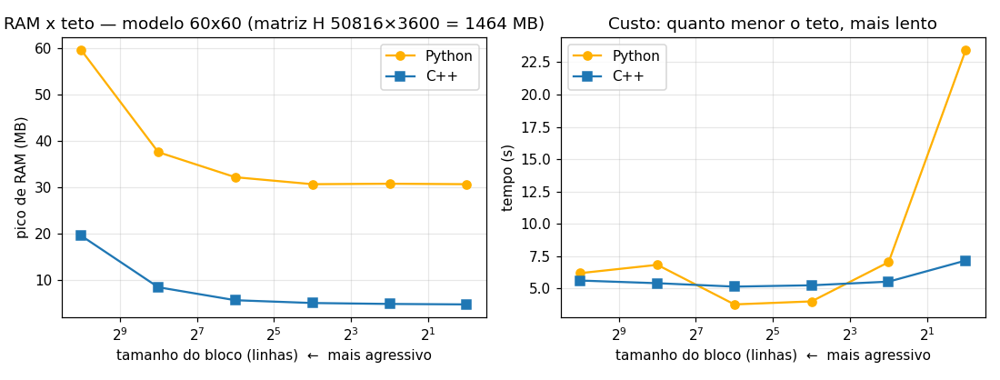
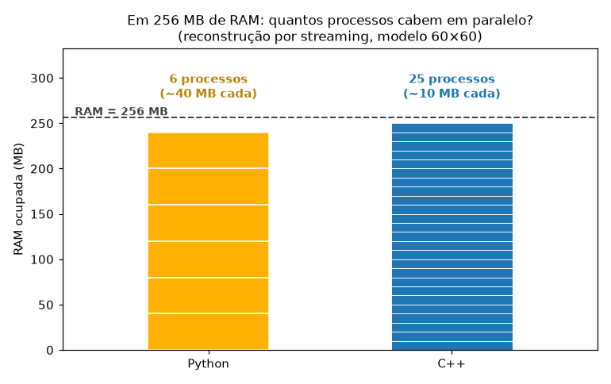

# Extras e Glossário

Documento **complementar** à [APRESENTACAO.md](APRESENTACAO.md). Aqui ficam:

- **Parte 1 - Extras:** experimentos e análises além do que o enunciado pede (a
  lentidão relativa do Python a baixo nível e a reconstrução com pouca memória).
- **Parte 2 - Glossário:** o significado dos termos técnicos (GEMV, BLAS, SIMD, …),
  para consulta posterior.

Assim a apresentação (o trabalho) fica separada dos extras e do dicionário.

**Conteúdo:** 1.1 Lentidão do Python a baixo nível · 1.2 Reconstrução com pouca
memória (simulação de servidor, série de tetos, paralelismo) · Parte 2 Glossário.

---

# Parte 1 - Extras

## 1.1 Por que o Python é um pouco mais lento? (a baixo nível)

Mesmo usando a **mesma BLAS** (ver glossário) do C++, o Python fica alguns por
cento atrás. Por quê? A figura abaixo é um **esquema** do tempo de **uma iteração**
do Gradiente Conjugado. A faixa azul (**GEMV**) é a multiplicação matriz-vetor - a
**conta pesada**, idêntica nos dois e que ocupa **~90% do tempo**. A diferença está
na **sobrecarga** (*overhead*): o trabalho ao redor da conta. *(As proporções são
ilustrativas e valem para os dois modelos, pois a GEMV domina em ambos.)*

Um passo como `f = f + α·p` parece inofensivo, mas no Python custa caro nos
bastidores:

| Elemento | No Python (NumPy) | No C++ |
|----------|-------------------|--------|
| **Alocação de memória** | `f = f + α·p` cria um **array NOVO** (malloc) a cada passo; o antigo é descartado. ~5 alocações por iteração. | `cblas_daxpy` escreve **no mesmo array** (in-place): **zero** alocação. |
| **Interpretador** | cada operação é despachada em tempo de execução (verifica tipos, formatos, dimensões) antes de chamar o código em C. | vira **código de máquina** direto, decidido na compilação - sem despacho. |
| **Objetos / coletor de lixo** | todo array é um **objeto Python** (cabeçalho, contagem de referências); o *garbage collector* recolhe os descartados. | apenas um `double[]` cru - sem objeto, sem GC. |

**Tamanho do efeito:** como a GEMV domina (~90%), essa sobrecarga é **pequena**
neste problema - por isso, com a mesma BLAS, o resultado é praticamente um empate.
Ela só pesaria muito se as contas fossem **pequenas e frequentes** (aí o
interpretador e as alocações dominariam), que é o que acontece no teto extremo da
seção 1.2.

---

## 1.2 Reconstrução com POUCA memória (streaming + float32)

E se o hardware tivesse pouca RAM? Com memória sobrando, segurar a matriz `H`
inteira (1,46 GB no 60×60!) é trivial - e a comparação fica "fácil". Para deixar
**interessante**, fizemos uma versão que **nunca carrega `H` inteira**: lê a matriz
do disco **em blocos** e em **float32** (metade do tamanho), fazendo a conta de
forma incremental. O pico de RAM passa a ser do tamanho de **um bloco**, não da
matriz toda.

### Simulação: um servidor com pouca RAM

Para tornar o resultado concreto, simulamos um **servidor com apenas 256 MB de RAM**,
impondo um teto **real** de memória ao processo (via *Job Object* do Windows: o
sistema operacional barra qualquer alocação acima do teto). Reconstruímos uma imagem
do **modelo 60×60 (matriz H 50816×3600)** das duas maneiras:

- **Carregar a matriz inteira de uma vez → falha** (`MemoryError`): precisa de
  ~1464 MB, quase **6× a RAM do servidor**. Não cabe.
- **Streaming (Python) → cabe**, usando ~**38 MB**.
- **Streaming (C++) → cabe**, usando ~**10 MB**.

Ou seja: num servidor com pouca memória, carregar tudo de uma vez **nem executa**;
o streaming executa sem problema. (Arquivo `extras/simular_pouca_ram.py`.)

### Série de tetos cada vez mais agressivos

Reduzimos o bloco de 1024 linhas até o **extremo de 1 linha por vez**, para ver até
onde é possível diminuir a memória (modelo 60×60, matriz H 50816×3600 = 1464 MB):

| Bloco (linhas) | Python RAM | tempo | C++ RAM | tempo |
|:--------------:|-----------:|------:|--------:|------:|
| 1024 | 61 MB | 6,9 s | 21 MB | 7,4 s |
| 256  | 39 MB | 8,0 s | 10 MB | 8,1 s |
| 64   | 34 MB | 4,6 s | 7 MB | 5,7 s |
| 16   | 33 MB | 5,0 s | 6 MB | 6,2 s |
| 4    | 32 MB | 7,9 s | 6 MB | 7,7 s |
| **1 (extremo)** | **32 MB** | **27 s** | **6 MB** | **7,6 s** |

Três conclusões:

- **O streaming reduz a memória drasticamente:** reconstruímos o 60×60 com **6 MB**
  (C++) em vez de manter 1,46 GB - mais de **200× menos**, com a mesma imagem (a
  `norma` de `f` é 1859 em todos os casos).
- **Existe um piso:** reduzir o bloco diminui a RAM até um mínimo. O Python
  **estabiliza** em ~**32 MB** (o interpretador + NumPy ocupam isso antes de
  qualquer dado); o C++ chega a ~**6 MB**. Por isso o C++ usa de **~3× a ~5,5× menos
  RAM** (ex.: no bloco de 16 linhas, 33 MB ÷ 6 MB ≈ 5,5×).
- **No teto extremo (1 linha por vez), o Python fica muito mais lento:** vai a
  **27 s**, enquanto o C++ se mantém em **7,6 s**. É a sobrecarga da seção 1.1
  multiplicada por um milhão de operações minúsculas - o custo do interpretador por
  operação passa a dominar. O C++, sem esse custo, fica ~**3,5× mais rápido**.

### O fechamento: footprint menor → mais paralelismo

O rodapé de memória menor do C++ tem uma consequência importante num servidor:
**cabem mais processos em paralelo na mesma RAM.** Cada processo Python carrega
~40 MB de base (interpretador + NumPy); cada processo C++, ~10 MB. Num servidor de
256 MB:

Cabem cerca de **6 processos Python** contra **25 processos C++** simultâneos. Como
cada processo reconstrói imagens, **mais processos significam mais imagens por
segundo**. É aqui que tudo se conecta com o objetivo do projeto ("reconstruir o
maior número de imagens no menor tempo"): sob memória limitada, o footprint menor do
C++ se converte em **mais paralelismo** e, portanto, **mais throughput**.

> **Resposta a "o C++ ganharia num hardware limitado?": sim, em três frentes** - usa
> muito menos memória, aguenta tetos agressivos sem perder desempenho, e permite mais
> processos em paralelo. Quanto mais restrito o hardware, mais a linguagem compilada
> importa. (Arquivos `extras/experimento_memoria.py`, `extras/experimento_memoria.cpp`
> e `extras/simular_pouca_ram.py`.)

---

# Parte 2 - Glossário

Termos em ordem aproximada de "do problema" → "da computação".

### O problema (modelo do ultrassom)

- **Reconstrução de imagem / problema inverso** - descobrir a imagem `f` a partir
  do sinal medido `g`, sabendo o modelo `H` (`g = H·f`). É "inverso" porque vamos
  do efeito (eco) de volta para a causa (imagem).
- **g (sinal)** - vetor com os ecos medidos pelos sensores. *Conhecido.*
- **H (matriz do modelo)** - descreve como cada ponto da imagem contribui para cada
  medida. *Conhecida.* É grande (ex.: 50816×3600) e mal-condicionada.
- **Mal-condicionada / condicionamento** - uma matriz é mal-condicionada quando
  pequenas variações em `g` (ruído) causam **grandes** variações na solução `f`.
  Por isso inverter `H` diretamente amplificaria o ruído e não funciona - daí os
  métodos iterativos com parada antecipada.
- **f (imagem)** - o que queremos descobrir (a incógnita). Vira uma imagem quadrada
  (900 pixels = 30×30; 3600 = 60×60).
- **S, N** - número de amostras no tempo (`S`) e número de sensores (`N = 64` aqui).
  O sinal `g` tem `S·N` valores.
- **Ganho γ (TGC, *Time Gain Compensation*)** - amplifica as amostras mais
  profundas (`γ_l = 100 + (1/20)·l·√l`) para compensar a atenuação do som no
  corpo. Sem ele, o sinal é minúsculo e o algoritmo para cedo demais.

### Os algoritmos

- **Gradiente Conjugado** - método **iterativo** para resolver sistemas lineares
  grandes: melhora a solução um passo de cada vez, sem inverter a matriz.
- **CGNE** (*Conjugate Gradient Normal Error*) - variante do gradiente conjugado
  que caminha no espaço da imagem (método de Craig).
- **CGNR** (*Conjugate Gradient Normal Residual*) - variante que minimiza o resíduo
  (Saad, 2003). Para este problema, CGNE e CGNR chegam à mesma imagem.
- **Resíduo (r)** - o "erro" `r = g − H·f`: o quanto a imagem atual ainda não
  explica o sinal. O algoritmo tenta encolher `r`.
- **Norma ‖·‖ (L2)** - o "tamanho" de um vetor: `√(soma dos quadrados)`. `‖r‖` mede
  o tamanho do resíduo.
- **ε (erro / critério de parada)** - o **valor absoluto** da variação da norma do
  resíduo entre duas iterações: `ε = | ‖r(i+1)‖ − ‖r(i)‖ |`. Quando fica `< 10⁻⁴`
  (ou após 10 iterações), paramos.
- **c (fator de redução)** = `‖HᵀH‖₂` (**norma espectral**): o **maior alongamento**
  que o operador aplica - o maior autovalor de `HᵀH` (= quadrado do maior valor
  singular de `H`). Mede a escala do operador, **não** o número de condicionamento
  (que dependeria também do menor valor singular).
- **Método da potência (*power iteration*)** - algoritmo que estima o maior autovalor
  de uma matriz multiplicando repetidamente um vetor por ela e normalizando. Usamos
  para calcular `c`.
- **λ (coeficiente de regularização)** = `max(|Hᵀg|)·0,10`. Parâmetro que controla
  o quanto se "suaviza" a solução. Aqui a regularização vem, na prática, da **parada
  antecipada** (no máx. 10 iterações).
- **Iteração** - uma volta do laço do algoritmo (uma melhora da imagem).

### Álgebra linear e bibliotecas

- **BLAS** (*Basic Linear Algebra Subprograms*) - um **padrão** de funções de
  álgebra linear (multiplicar matrizes/vetores, somar, etc.) altamente otimizadas.
  Quase toda computação numérica séria roda em cima de uma BLAS.
  - **Nível 1** - vetor com vetor (ex.: `DAXPY`, `DDOT`, `DNRM2`).
  - **Nível 2** - matriz com vetor (ex.: **GEMV**).
  - **Nível 3** - matriz com matriz (`GEMM`); é o nível que mais ganha com paralelismo.
- **OpenBLAS** - uma **implementação** concreta da BLAS (de código aberto). O NumPy
  a usa por baixo; nosso C++ também (a mesma versão, 0.3.31), para a comparação ser justa.
- **GEMV** (*GEneral Matrix-Vector multiply*) - a operação `y = H·x` (e `y = Hᵀ·x`).
  É o **gargalo** deste projeto. Por ser nível 2, é **limitada pela banda de memória**.
- **DAXPY / DDOT / DNRM2** - operações BLAS de nível 1 usadas no laço:
  `DAXPY` faz `y = y + α·x` (in-place); `DDOT` é o produto interno; `DNRM2` é a norma.
- **CBLAS (`cblas_*`)** - a **interface C** da BLAS. As funções `cblas_dgemv`,
  `cblas_ddot`, `cblas_dnrm2`, `cblas_daxpy` no C++ são as mesmas da OpenBLAS que o
  NumPy chama por baixo.
- **NumPy** - biblioteca de arrays numéricos do Python; suas operações chamam a BLAS
  em C/Fortran (por isso é rápida, apesar do Python ser interpretado).

### Desempenho e hardware

- **Banda de memória (*memory bandwidth*)** - a velocidade com que a CPU lê dados da
  RAM. A GEMV lê a matriz inteira a cada passo, então é a RAM (não a CPU) que limita;
  por isso colocar mais núcleos ajuda só até saturar a memória.
- **Núcleo / thread / paralelismo** - um processador moderno tem vários **núcleos**;
  rodar partes do cálculo em **threads** paralelas usa todos eles ao mesmo tempo.
- **OpenMP** - uma forma simples de paralelizar laços em C/C++ (`#pragma omp ...`).
  Usamos para dividir a GEMV entre todos os núcleos - é o que faz o C++ vencer.
- **SIMD** (*Single Instruction, Multiple Data*) - instruções da CPU que multiplicam
  vários números de uma vez. Ativado com `-O2 -march=native` no compilador.
- **Interpretado × Compilado** - Python é **interpretado** (cada operação é decidida
  em tempo de execução); C++ é **compilado** (vira código de máquina antes de rodar,
  sem essa sobrecarga por operação).
- **GIL** (*Global Interpreter Lock*) - trava do Python que impede dois trechos de
  código Python de rodarem ao mesmo tempo (a BLAS, em C, libera o GIL durante a conta).
- **Alocação de memória / heap / malloc** - o **heap** é a região de memória para
  alocação dinâmica (em tempo de execução); **malloc** é a função (em C) que reserva
  um bloco nele. No NumPy, `f = f + α·p` aloca um array novo a cada passo (custa tempo).
- **in-place** - escrever o resultado **no mesmo** vetor, sem alocar outro
  (ex.: `cblas_daxpy`). Economiza tempo e memória.
- **Coletor de lixo (*garbage collector*, GC)** - mecanismo do Python que libera
  automaticamente os objetos que ninguém usa mais; tem um custo.
- **float32 / float64** - números de ponto flutuante de 32 bits (4 bytes) ou 64 bits
  (8 bytes). Usar `float32` corta a memória pela metade, com precisão suficiente aqui.
- **Streaming / processamento em blocos** - em vez de carregar a matriz inteira na
  RAM, ler/processar um pedaço (bloco) de cada vez. Mantém o pico de RAM minúsculo.
  É o oposto de "carregar tudo de uma vez".
- **Pico de RAM (*peak working set*)** - a maior quantidade de memória que o processo
  chegou a usar. É o que medimos no experimento de memória.
- **Job Object (Windows)** - recurso do Windows que permite impor limites a um
  processo (ex.: um **teto de memória**). Usamos para simular um servidor com pouca
  RAM: acima do teto, qualquer alocação falha de verdade.
- **Throughput (vazão)** - quantas imagens são reconstruídas por unidade de tempo.
  Medimos pelo **tempo mediano** por imagem (a mediana é robusta a picos de carga).
- **"No talo"** - rodar o Python na sua configuração mais rápida, **sem nenhuma
  restrição artificial** (ex.: sem limitar as threads da OpenBLAS), para a comparação
  não prejudicar o lado interpretado.
- **g++ / MSYS2 / MinGW** - o **compilador** C++ (`g++`) e o ambiente que o fornece no
  Windows (MSYS2/MinGW). É o *toolchain* (cadeia de ferramentas) compilado do projeto.

### Sistemas distribuídos

- **Cliente / Servidor** - o **cliente** envia os sinais; o **servidor** reconstrói
  e devolve a imagem. São processos separados que conversam pela rede.
- **TCP / socket** - o "cano" de comunicação pela rede; `socket` é a ponta desse cano
  em cada lado. Usamos TCP local (`127.0.0.1`).
- **Protocolo** - o combinado de como cliente e servidor trocam dados. Aqui: um
  **cabeçalho de texto** (linha ASCII com os metadados) seguido do **corpo binário**
  (os números `float64` crus, sem virar texto - mais rápido e exato).
- **Semente (*seed*)** - valor que inicializa o gerador de números pseudo-aleatórios.
  Fixar a semente (`SEED = 42`) torna a sequência de sinais **reproduzível e
  idêntica** para os servidores Python e C++ (comparação justa).
